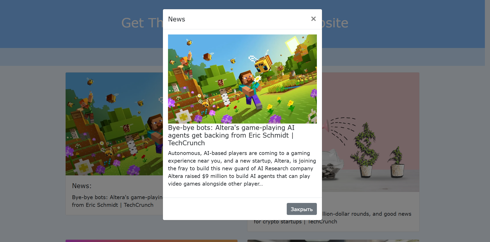
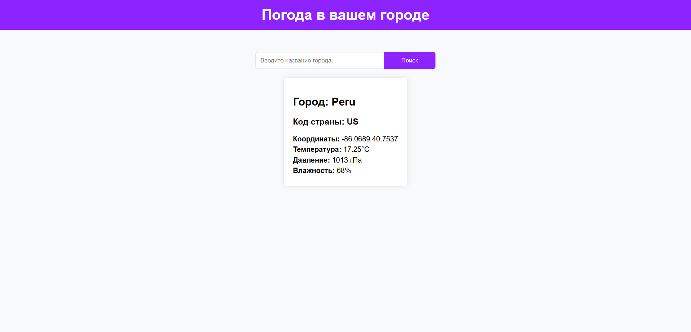
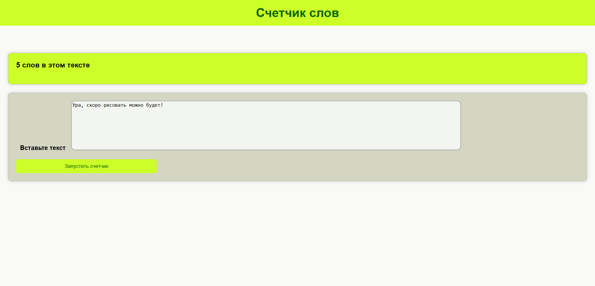

<h1>Проекты на Django</h1>
<ui>
    <li>Сайт с новостями</li>
    
    
Всплывающие окно при нажатии на новость

    
    <li>Сайт про погоду</li>
    
    <li>Сайт для подсчета количества слов</li>
    
</ui>